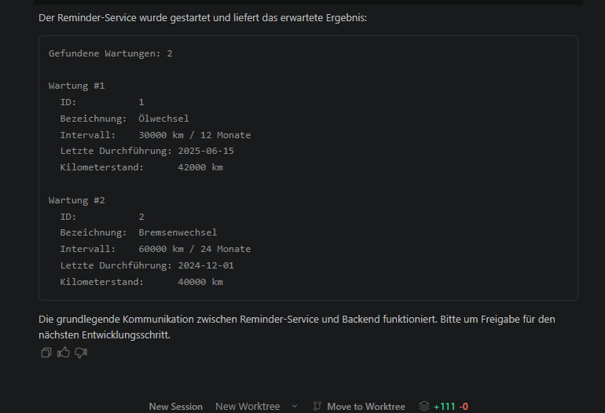

# CarCare-Distributed

## Projektbeschreibung

CarCare-Distributed ist eine kleine verteilte Anwendung zur Verwaltung von Fahrzeugen und deren Wartungen. Das Backend stellt die Daten über eine REST-Schnittstelle bereit, während ein separater Reminder-Service diese Daten über HTTP abruft und in der Konsole ausgibt. Die Anwendung besteht aus zwei unabhängigen Prozessen, die über HTTP kommunizieren.

## Aufbau der verteilten Anwendung

Die Anwendung ist in zwei Komponenten aufgeteilt:

- **Backend** – Speichert Fahrzeug- und Wartungsdaten und stellt sie über eine REST-API zur Verfügung
- **Reminder-Service** – Fragt das Backend ab und zeigt die Wartungen übersichtlich in der Konsole an

## Kommunikation

Die beiden Prozesse kommunizieren über HTTP und JSON:

```
+---------------------+        HTTP GET         +---------------------+
|                     |   /api/vehicles/:id/   |                     |
|  Reminder-Service   | ---------------------> |       Backend       |
|                     |   /maintenances        |                     |
|  (Node.js)          | <--------------------- |  (Node.js + Express)|
|                     |      JSON-Antwort      |                     |
+---------------------+                        +---------------------+
```

## Technologien

- Node.js
- Express (Backend)
- Eingebautes `http`-Modul (Reminder-Service)
- JSON als Datenaustauschformat

## Projektstruktur

```
CarCare-Distributed/
├── backend/
│   ├── package.json
│   └── src/
│       ├── server.js          # Server-Startpunkt
│       ├── app.js             # Express-App mit Middleware und Routen
│       ├── data/
│       │   ├── store.js       # In-Memory-Speicher für Fahrzeuge
│       │   └── maintenanceStore.js  # In-Memory-Speicher für Wartungen
│       └── routes/
│           ├── vehicles.js    # REST-Routen für Fahrzeuge
│           └── maintenances.js  # REST-Routen für Wartungen
├── reminder-service/
│   ├── package.json
│   └── index.js               # Service zum Abrufen und Anzeigen von Wartungen
└── README.md
```

## Startanleitung

### Voraussetzungen

- Node.js ist auf dem System installiert

### 1. Backend starten

```bash
cd backend
npm install
npm start
```

Der Backend-Server läuft anschließend unter `http://localhost:3000`.

### 2. Reminder-Service starten

In einem zweiten Terminalfenster:

```bash
cd reminder-service
node index.js
```

Der Reminder-Service fragt automatisch die Wartungen für Fahrzeug 1 ab und gibt sie in der Konsole aus.

## Entwicklung

Dieses Projekt wurde schrittweise mit Unterstützung von Kilo Code entwickelt. Nach jedem Entwicklungsschritt wurden die Änderungen getestet, mit Git versioniert und auf GitHub dokumentiert.

## Funktionstest

Der Reminder-Service ruft die Wartungsdaten erfolgreich vom Backend ab und gibt sie in der Konsole aus.

